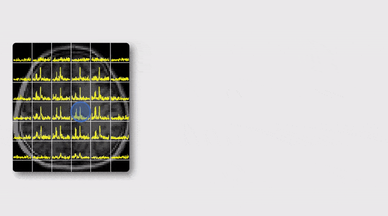

## Stabilizing Deep Learning-Based Image Reconstruction
Image reconstruction from limited and/or sparse data is known to be an ill-posed problem and a priori information/constraints have played an important role in solving the problem. Early constrained image reconstruction methods utilize image priors based on general image properties such as sparsity, low-rank structures, spatial support bound, etc. Recent deep learning-based reconstruction methods promise to produce even higher quality reconstructions by utilizing more specific image priors learned from training data. However, learning high-dimensional image priors requires huge amounts of training data that are currently not available in medical imaging applications. As a result, deep learning-based reconstructions often suffer from two known practical issues: a) sensitivity to data perturbations (e.g., changes in data sampling scheme), and b) limited generalization capability (e.g., biased reconstruction of lesions). This paper proposes a new method to address these issues. The proposed method synergistically integrates model-based and data-driven learning in three key components. The first component uses the linear vector space framework to capture global dependence of image features; the second exploits a deep network to learn the mapping from a linear vector space to a nonlinear manifold; the third is an unrolling-based deep network that captures local residual features with the aid of a sparsity model. The proposed method has been evaluated with magnetic resonance imaging data, demonstrating improved reconstruction in the presence of data perturbation and/or novel image features. The method may enhance the practical utility of deep learning-based image reconstruction.

## Machine Learning Enabled High-Resolution DMRSI

Deuterium magnetic resonance spectroscopic imaging (DMRSI) has recently been recognized as a potentially powerful tool for noninvasive imaging of brain energy metabolism and tumor. However, the low sensitivity of DMRSI has significantly limited its utility for both research and clinical applications. This work presents a novel machine learning-based method to address this limitation. The proposed method synergistically integrates physics-based subspace modeling and data-driven deep learning for effective denoising, making high-resolution dynamic DMRSI possible. Specifically, a novel subspace model was used to represent the dynamic DMRSI signals; deep neural networks were trained to capture the low-dimensional manifolds of the spectral and temporal distributions of practical dynamic DMRSI data. The learned subspace and manifold structures were integrated via a regularization formulation to remove measurement noise. Theoretical analysis, computer simulations, and in vivo experiments have been conducted to demonstrate the denoising efficacy of the proposed method which enabled high-resolution imaging capability. The translational potential was demonstrated in tumor-bearing rats, where the Warburg effect associated with cancer metabolism and tumor heterogeneity were successfully captured. The new method may not only provide an effective tool to enhance the sensitivity of DMRSI for basic research and clinical applications but also provide a framework for denoising other spatiospectral data.

## Improved Estimation of Myelin Water Fractions with Learned Parameter Distributions

Myelin water fraction (MWF) mapping can substantially improve our understanding of several demyelinating diseases. While MWF maps can be obtained from multi-exponential fitting of multi-echo imaging data, current solutions are often very sensitive to noise and modeling errors. Our work first conducted a systematic sensitivity analysis to characterize the conventional exponential models used for MWF estimation. A new estimation method was then proposed for improved estimation of MWF from practical gradient-echo imaging data. The proposed method uses an extended signal model that includes a finite impulse response filter to compensate for practical signal variations. This new model also enables the use of pre-learned parameter distributions as well as low-rank signal structures to improve parameter estimation. The resulting parameter estimation problem was solved optimally in the Bayesian sense. Our sensitivity analysis results showed that the conventional exponential models were very sensitive to measurement noise and modeling errors. Our simulation and experimental results showed that our proposed method provided a substantial improvement in reliability, reproducibility, and robustness of MWF estimates over the conventional methods.  Clinical results obtained from stroke patients indicated that the proposed method, with its improved capability,  could reveal the loss of myelin in lesions, demonstrating its translational potentials.

## Machine Learning Enabled Multi-Parameter Mapping of Multiple Molecules of the Brain

MR spectroscopic imaging (MRSI) is a unique tool for noninvasive metabolic imaging and it has been used to map the molecular fingerprints of brain function and diseases. Recently, quantitative susceptibility mapping (QSM) and myelin water imaging (MWI) have also been widely used to study brain tissue iron deposition and white matter integrity. Currently, MRSI, QSM and MWI experiments are carried out independently using different acquisition sequences, which often lead to long data acquisition times. This paper reports our success in integrating MRSI, QSM and MWI for brain imaging. This work is built on our recent progress in using the SPICE (SPectroscopic Imaging by exploiting spatiospectral CorrElation) subspace imaging framework for simultaneous QSM and MRSI. We extend this technique in both data acquisition and processing to enable rapid simultaneous MRSI, QSM and MRSI in high spatial resolution. In data acquisition, we further reduce TE/TR and use a variable-density sampling strategy via blipped EPSI trajectories to achieve rapid high-resolution acquisition. In data processing, we reconstruct the spatial distributions of brain metabolites, myelin water fractions (MWF), and tissue susceptibility using model-based constrained reconstruction methods, incorporating pre-learned spatiospectral features. Experimental results have been obtained which demonstrate that in a 5-min scan, we can obtain metabolites in 2.0×2.4×3 mm3 and QSM/MWF in 1.8×1.8×1.8 mm3. This capability may significantly enhance the practical utility of 1H-MRSI in various research and clinical applications.

## A Subspace Approach to Spectral Quantification for MR Spectroscopic Imaging

Magnetic resonance spectroscopic imaging (MRSI) is a unique tool for non-invasive, label-free molecular
imaging, and spectral quantification is a critical step in deriving quantitative molecular information from the measured MRSI data. However, obtaining accurate spectral estimates is rather challenging due to the low signal-to-noise ratio (SNR) of the measured data and nonlinearity of the underlying parameter estimation problem. In this work, we introduce a new subspace framework characterized by the
use of a union-of-subspaces model to represent the spectral distributions of each molecule as a subspace and the entire spectrum as a union-of-subspaces. Based on this model, the spectral quantification can be solved in two steps: a) subspace estimation based on the empirical distributions of the spectral parameters estimated using spectral priors, and b) parameter estimation for the union-of-subspaces model incorporating spatial priors. The proposed method has been evaluated using both simulated and experimental data, producing impressive results.

