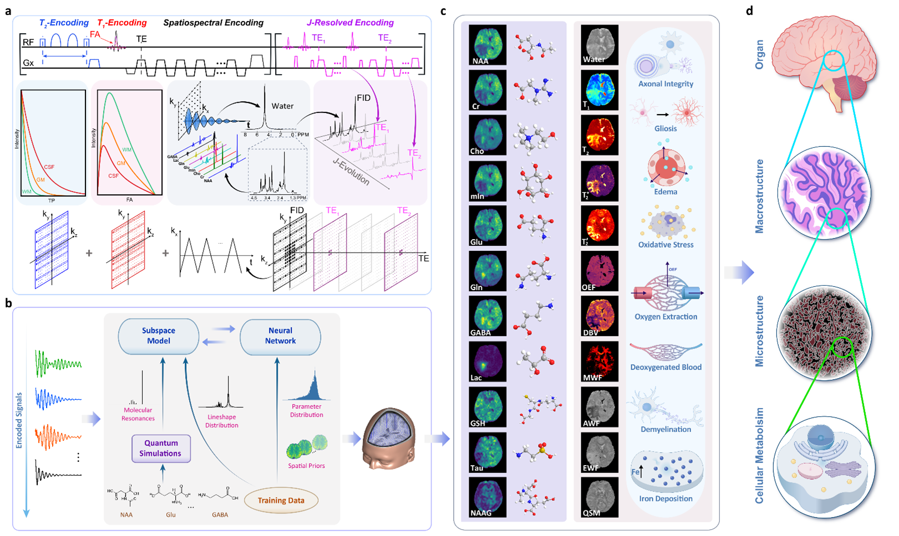
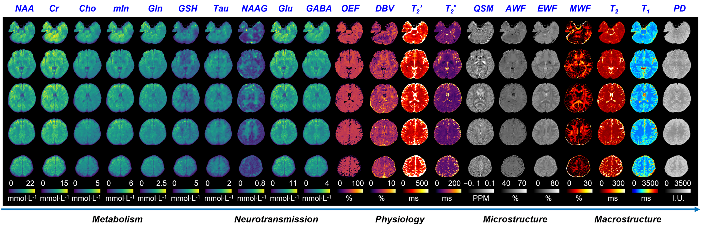
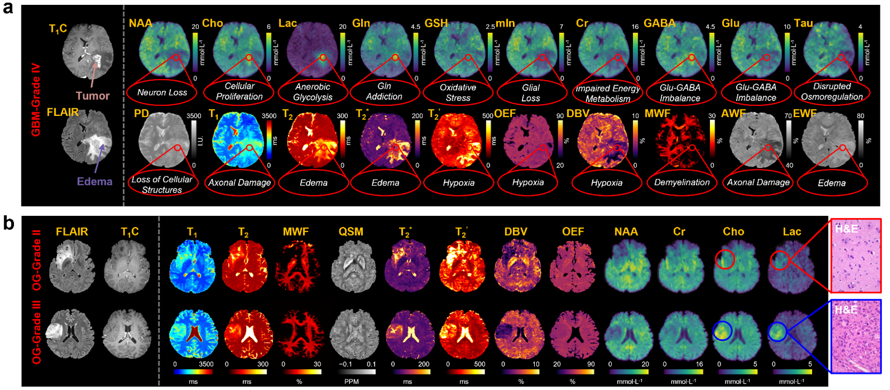
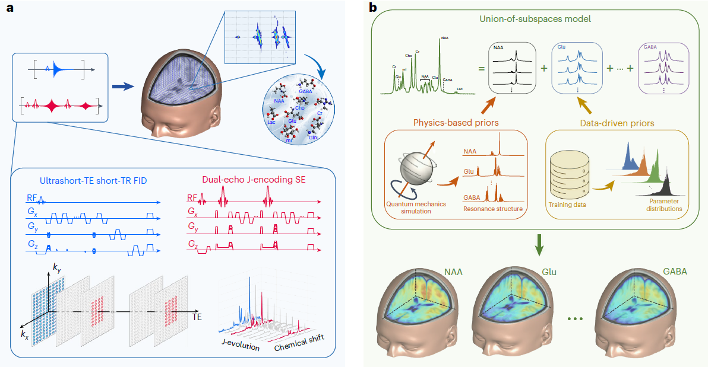
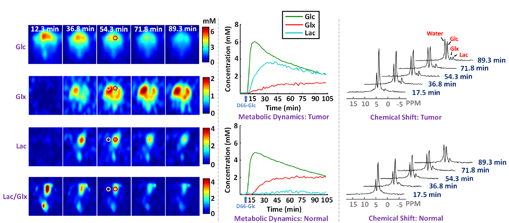
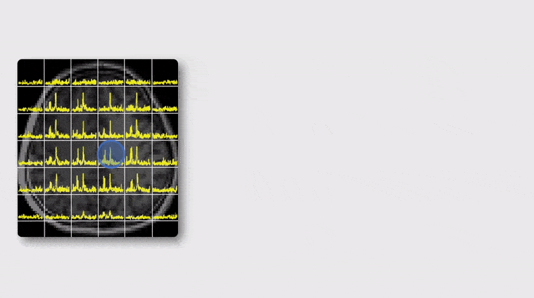

## Multiplexed Magnetic Resonance Imaging (MRx)
Magnetic resonance imaging (MRI) has revolutionized diagnostic radiology and medicine over the last five decades. However, the application of conventional MRI in clinical routine is still mainly limited to visual examination of macroscopic tissue pathology. Since diseases, such as tumors, multiple sclerosis and neurodegenerative disorders, are highly heterogeneous, there is a critical need for a noninvasive imaging technology that can provide quantitative biomarkers for tissue characterization for personalized and precision medicine. We introduce a new approach to MRI data acquisition and data processing, called “multiplexed MRI (MRx)”, to achieve high-resolution simultaneous multiparametric mapping of multiple molecules. We demonstrate that MRx can obtain a large set of quantitative structural, molecular and physiological biomarkers of the whole brain in regular clinical settings. We further demonstrate that these biomarkers could define an effective tissue state index that enables accurate disease subtyping and lesion characterization in tumors and multiple sclerosis. We anticipate that the new quantitative multiplexed imaging capabilities of MRx will significantly enhance the capability of MRI for diagnosis, monitoring, and assessment of therapeutic efficacy of many neurological diseases, and potentially transform brain imaging for both research and clinical applications.

Selected publications:  
[1] **Y. Li**, R. Guo, Y. Zhao, W. Jin, Z. Ke, L. Chen, X. Chen, W. Tang, Y. Li, Z.-P. Liang, “Multiplexed magnetic resonance imaging,” in press.  
[2] R. Guo, **Y. Li**, Y. Zhao, T. Wang, Y. Li, B. Sutton, and Z.-P. Liang, and W. Chen, “Simultaneous mapping of water diffusion coefficients and metabolite distributions of the brain using MR spectroscopic imaging without water suppression,” IEEE Trans. Biomed. Eng., vol. 70, pp. 962-969, 2022.  
[3] R. Guo, Y. Zhao, **Y. Li**, T. Wang, Y. Li, B. Sutton, and Z.-P. Liang, “Simultaneous QSM and metabolic imaging of the brain using SPICE: further improvements in data acquisition and processing”, Magn. Reson. Med., 85.2 (2021): 970-977.  
[4] R. Guo, Y. Zhao, **Y. Li**, Y. Li, and Z.‐P. Liang, “Simultaneous metabolic and functional imaging of the brain using SPICE.” Magn. Reson. Med., vol. 82, pp. 1993-2002, 2019.  
[5] X. Peng, F. Lam, **Y. Li**, B. Clifford, and Z.-P. Liang, “Simultaneous QSM and metabolic imaging of the brain using SPICE,” Magn. Reson. Med., vol. 79, pp. 13-21, 2017.  

***Simultaneous mapping of multiple quantitative structural, molecular, and physiological biomarkers.** a, High-speed acquisition of multiparametric spatial-spectral encodings which include: (1) wideband pulses to excite all the detectable molecules in a spin system, (2) rapid data sampling in echo-planar trajectories, (3) supplementary encodings for transversal relaxation, longitudinal relaxation and J-evolution, and (4) variable-density sparse sampling of the high- dimensional data space. b, AI-powered data processing for reconstruction, separation, and quantification of all the detectable biomarkers from the measured data. Physics-based subspace models are synergistically integrated with neural networks to enable effective processing of highly sparse, noisy data. c, Structural, molecular, and physiological biomarkers obtained simultaneously using MRx. d, Tissue characterization across multiple spatial scales using the MRx biomarkers.*

***High-resolution MRx biomarkers obtained from a healthy volunteer**, including NAA, Cr, Cho, mIn, Gln, GSH, Tau, NAAG, Glu, GABA, OEF, DBV, T2, T2\*, QSM, AWF, EWF, MWF, T2, T1 and PD. These biomarkers provide a wide range of information for tissue characterization at several spatial scales and physiological processes.*

***MRx in brain tumor.** a, Experimental results from one patient histologically diagnosed with grade IV GBM. The MRx biomarkers (NAA, Cho, Lac, Gln, GSH, mIn, Cr, GABA, Glu, Tau, PD, T1, T2, T2\*, T2’, OEF, DBV, MWF, AWF, and EWF) clearly revealed the key pathological processes underlying tumor and edema tissues compared with the healthy tissue. b, Experimental results from two patients who were histologically diagnosed with grade II and grade III OG, respectively: images of clinical MRI (FLAIR and T1C) and MRx markers (T1, T2, MWF, QSM, T2\*, T2’, DBV, OEF, NAA, Cr, Cho, and Lac). Note that the clinical images cannot distinguish between the tumors in different grades; the limitation was overcome by MRx that revealed significant differences between grade II and grade III OG, especially the elevated Cho and Lac.*

## Ultrafast High-Resolution Magnetic Resonance Spectroscopic Imaging (MRSI)
Ultrafast high-resolution MRSI: Over the past 10 years, I have been focused on developing advanced mathematical models, computational algorithms, and data acquisition schemes to improve resolution, signal-to-noise-ratio (SNR), and speed of MR spectroscopic imaging (MRSI). More specifically, in collaboration with Prof. Zhi-Pei Liang's group, we overcame several challenging technical problems in MRSI and developed a transformative ultrafast high-resolution MRSI technology. More recently, we have also successfully integrated physics-based signal modelling and data-driven deep learning to enable dynamic X-nuclei MRSI with unprecedented spatiotemporal resolution.

Selected publications:  
[1] Y Zhao, **Y Li**, W Jin, R Guo, C Ma, W Tang, Y Li, GE. Fakhri, Z-P Liang, “Ultrafast J-resolved magnetic resonance spectroscopic imaging for high-resolution metabolic brain imaging,” Nat. Biomed. Eng., vol. 9, pp. 1835–1847, 2025.  
[2] R. Guo, **Y. Li**, Y. Zhao, W. Jin, Y. Chai, A. Anderson, W. Hassaneen, B. Damon, T. Wszalek, Y. Li, H.M. Wiesner, X. H. Zhu, W. Chen, B. P. Sutton, Z.-P. Liang, “High-resolution brain metabolic imaging at ultrahigh field using extended spatiospectral encoding and subspace modeling,” IEEE Trans Biomed Eng., vol. 72, pp. 3558-3566, 2025. (Cover article).  
[3] X. Li, X.-H., Zhu, **Y. Li**, T. Wang, G. Zhang, H.-M. Wiesner, Z.-P. Liang, W. Chen, “Quantitative mapping of key glucose metabolic rates in the human brain using dynamic deuterium magnetic resonance spectroscopic imaging,” PNAS Nexus, vol. 4, pp. :pgaf072, 2025.  
[4] Y. Zhao, **Y. Li**, R. Guo, W. Jin, B. Sutton, C. Ma, G. El Fakhri, Y. Li, J. Luo, Z.-P. Liang, “Accelerated 3D metabolite T1 mapping of the brain using variable-flip-angle SPICE,” Magn Reson Med, 92(4):1310-1322, 2024.  
[5] **Y. Li**, Y. Zhao, R. Guo, T. Wang, Y. Zhang, M. Chrostek, W.C. Low, X.-H. Zhu, Z.-P. Liang, and W. Chen, “Machine learning-enabled high-resolution deuterium MR spectroscopic imaging for dynamic metabolic imaging of brain cancer,” IEEE Trans. Med. Imaging, vol. 40, pp. 3879-3890, 2021.  
[6] L. Tang, Y. Zhao, **Y. Li**, R. Guo, B. Clifford, G. E. Fakhri, C. Ma, Z.-P. Liang, and J. Luo, “Accelerated J-resolved 1H-MRSI with limited and sparse sampling of (k,t_1)-space”, Magn. Reson. Med., vol. 85, pp. 30-41, 2021.  
[7] Y. Chen, **Y. Li\***, and Z. Xu, “Improved low-rank filtering of MR spectroscopic imaging data with pre-learnt subspace and spatial constraints," IEEE Trans. Biomed. Eng., vol. 67, pp. 2381-2388, 2019. (\*Corresponding Author)  
[8] F. Lam, **Y. Li**, R. Guo, B. Clifford, and Z.-P. Liang, “Ultrafast magnetic resonance spectroscopic imaging using SPICE with learned subspaces”, Magn. Reson. Med., vol. 83, pp. 377-390, 2020. (Editor’s Picks)  
[9] F. Lam, **Y. Li**, B. Clifford, and Z.-P. Liang, “Macromolecule mapping of the brain using ultrashort-TE acquisition and reference-based metabolite removal,” Magn. Reson. Med., vol. 79, pp. 2460-2469, 2017.  
[10] **Y. Li**, F. Lam, B. Clifford, and Z.-P. Liang, “A subspace approach to spectral quantification for MR spectroscopic imaging,” IEEE Trans. Biomed. Eng., vol. 64, pp. 2486-2489, 2017. (Highlighted Article)  

***High-resolution metabolic imaging using J-resolved MRSI.** a, The proposed data acquisition scheme integrates FID and SE signals to efficiently encode spatial, chemical shift spectral and J-coupling spectral information of multiple molecules. FID signals are acquired from extended k-space (for high spatial resolution) with Ernst angle excitations, ultrashort TE and short TR. SE signals are acquired from limited k-space (for fast imaging) with two J-evolution periods to encode J-coupling spectral information. This data
acquisition scheme achieves 3D high-resolution J-resolved MRSI in 12.5 min. b, The proposed data processing scheme reconstructs J-resolved MRSI data using a union-of-subspaces model that represents the spatiospectral distribution of each molecule by a subspace, whose structures (for example, spectral basis and spectral lineshape variations) are determined through quantum simulations and machine learning. The subspace model with learned spectral basis functions and parameter distributions enables effective denoising, removal of background
water and lipid signals and reconstruction of the desired spatiospectral function from sparsely sampled spatial-spectral-J-encoded data.*

***High-resolution dynamic DMRSI results of rat brain with a small tumor**, including time-dependent concentrationmaps (left panel),metabolic time courses (middle panel), and the time evolution of 2H-spectra (right panel); here, the metabolic time courses and spectra are from voxels at the center of the red and yellow circles within tumor and normal-appearing tissues, respectively.*

***A subspace framework for spectral quantification in MRSI.** The framework is characterized by the
use of a union-of-subspaces model to represent the spectral distributions of each molecule as a subspace and the entire spectrum as a union-of-subspaces. Based on this model, the spectral quantification can be solved in two steps: a) subspace estimation based on the empirical distributions of the spectral parameters estimated using spectral priors, and b) parameter estimation for the union-of-subspaces model incorporating spatial priors.*

## AI-Powered Magnetic Resonance Imaging 

I have also developed advanced methods to enable ultrafast highresolution MRI. Our primary approach is synergistic integration of physics-based image modelling and data-driven machine learning to enable high-quality image reconstruction from highly sparse imaging data. These methods have enabled several important applications, including highly accelerated structural MRI, ultrafast and robust quantitative imaging, and high-speed speech imaging.

Selected publications:  
[1] Y. Guan\*, **Y. Li\***, R. Liu, Z. Meng, Y. Li, L. Ying, Y. Du, and Z.-P. Liang, “Subspace model-assisted deep learning for improved image reconstruction,” IEEE Trans. Med. Imaging, vol. 42, pp. 3833-3846, 2023. (\*co-first authors)  
[2] **Y. Li**, J. Xiong, R. Guo, Y. Zhao, Y. Li, and Z.-P. Liang, “Improved estimation of myelin water fractions with learned parameter distributions,” Magn. Reson. Med., vol. 86, pp. 2795-2809, 2021.  
[3] R. Liu, **Y. Li**, Y. Li, YP Du, Z.-P Liang, “Information-theoretic analysis of multimodal image translation,” IEEE Trans Med Imaging, vol. 44, pp. 3210-3221, 2025.  
[4] Y. Guan, **Y. Li**, Z. Ke, X. Peng, R. Liu, Y. Li, Y. Du, and Z.-P. Liang, "Learning-assisted Fast Determination of regularization parameter in constrained image reconstruction," IEEE Trans. Biomed. Eng, vol. 71, pp. 2253-2264, 2024.  
[5] R. Jin, **Y. Li**, R. K. Shosted, F. Xing, I. Gilbert, J. Perry, J. Woo, Z.-P. Liang, B. P. Sutton, “Optimization of three-dimensional dynamic speech MRI: Poisson-disc under sampling and locally higher-rank reconstruction through partial separability model with regional optimized temporal basis”, Magn. Reson. Med., vol. 91, pp. 61-74, 2024.  
[6] T. Zhang, R. Guo, **Y. Li**, Y. Zhao, Y. Li, and Z.-P. Liang, “T_2^' mapping of the brain from water-unsuppressed 1H-MRSI and TSE data,” Magn. Reason. Med., vol. 88, pp. 2198-2207, 2022.  
[7] Y. Zhao, R. Guo, **Y. Li**, K.R. Thulborn, and Z.-P. Liang, “High-resolution sodium imaging using anatomical and sparsity constraints for denoising and recovery of novel features,” Magn. Reason. Med., vol. 86, pp. 625-636, 2021. (YIA Award of OCSMRM)  
[8] Z. Meng, R. Guo, **Y. Li**, Y. Guan, Y. Wang, Y. Zhao, B. Sutton, Y. Li, and Z.-P. Liang, “Accelerating T2 mapping of the brain by integrating deep learning priors with low‐rank and sparse modeling”, Magn. Reson. Med., 85.3 (2021): 1455-1467.  

## Clinical Applications of Ultrafast High-Resolution MRSI
I have been closely working with the clinical collaborators round the world to demonstrate the clinical feasibility of our ultrafast high-resolution MRSI technology in a range of real-world clinical applications. The preliminary clinical results have demonstrated our technology’s potential to: a) capture metabolic alterations associated with epilepsy, b) detect altered metabolic changes due to acute mild traumatic brain injury, Alzheimer’s disease, and brain tumor, and c) detect molecular fingerprints useful for assessment of brain tissue viability after stroke.

Selected publications:  
[1] Yao Li, **Y. Li**, Z.-P. Liang, "Magnetic Resonance Spectroscopic Imaging of Brain Plasticity," in Handbook of Cognitive Enhancement and Brain Plasticity, edited by Aron Barbey.  
[2] Y. Guo, Y. Wang, Y. Ni, B. Bo, J. He, Y. Zhu, A. Qin, X. Zhou, H. Du, Y. Liu, T. Wang, **Y. Li**, Y. Zhao, Z. Chen, Z. Liang, Y. Li, Y. Xu, and H. Zhang, “Iron overload mediates the differential cell fate of astrocytes from neurons and its regulatory mechanisms in ischemic stroke,” Adv. Sci. (Weinh)., vol. 13, no. 4, e07384, 2026.  
[3] Y. Zhang, X. H. Qian, H. Zhuang, W. Zhang, J. Hu, Y. Zhao, **Y. Li**, W. Jin, C. Xu, Z. Meng, W. Li, S. Chen, X. F. Jiang, T. Guo, Y. D. Li, J. Ye, Z.-P. Liang, B. Li, M. Zhang, H. Tang, and Y. Li, “Dual association patterns between microglial activation and neuronal health in Alzheimer's disease: a whole-brain MRSI/PET study,” Alzheimers Dement., vol. 22, no. 3, e71229, 2026.  
[4] K. Kim, **Y. Li**, L. Koch, Z.-P. Liang, X. Yu, “Altered acute metabolic response to muscle stimulation in muscular dystrophic mice observed by phosphorus-31 magnetic resonance spectroscopy and fingerprinting,” J. Appl. Physiol., vol. 139, pp. 628-637, 2025.  
[5] Z. Meng, R. Guo, T. Wang, B. Bo, Z. Lin, **Y. Li**, Y. Zhao, X. Yu, D. J. Lin, P. Nachev, Z.-P. Liang, and Y. Li, “Prediction of stroke onset time with joint fast high-resolution magnetic resonance spectroscopic and quantitative T2 mapping”, IEEE Trans. Biomed. Eng., vol. 70, pp. 3147-3155, 2023.  
[6] Z. Lin, Z. Meng, T. Wang, R. Guo, Y. Zhao, **Y. Li**, B. Bo, Y. Guan, J. Liu, H. Zhou, X. Yu, D.J. Lin, Z.-P. Liang, P. Nachev, and Y. Li, “Predicting the onset of ischemic stroke with fast high-resolution 3D MR spectroscopic imaging,” J. Magn. Reson. Imaging,  vol. 58, pp. 838-847, 2023. (W.S. Moore Award of ISMRM 2023)  
[7] Y. Li, T. Wang, T. Zhang, **Y. Li**, R. Guo, Y. Zhao, Z. Meng, Z. Lin, J. Liu, X. Yu, Z.-P. Liang, P. Nachev, “Fast high-resolution metabolic imaging of acute stroke with 3D magnetic resonance spectroscopy”, Brain, 143(11), 3225-3233. (Cover Article)  
